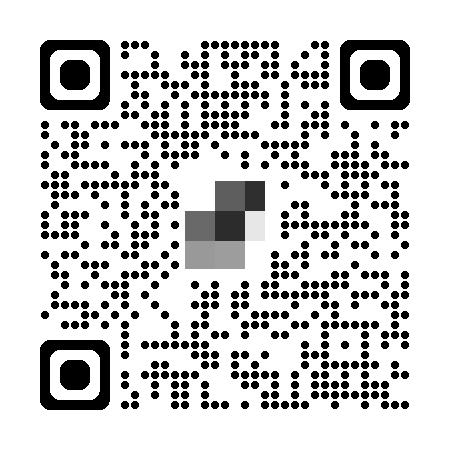

# 01418332 - Information Systems Security

### **Pre-Requisite**
- Operating Systems (01418236)

### **Lecturer**
- [Maykin Warasart](https://www.google.com/search?q="Maykin+Warasart") ([เมฆินทร์ วรศาสตร์](https://www.google.com/search?q="เมฆินทร์ วรศาสตร์")), [[FB](https://www.facebook.com/maeklong)] [[X](https://x.com/maeklong)]
	- Microsoft MVP (Most Valuable Professional) – Security
	- Approved Volunteer – Center for Cyber Safe and Education
	- Microsoft Certified Trainer (MCT)
	- Microsoft Certified Educator (MCE)
	- Google Certified Educator (GCE) Level 1 & 2
	- CompTIA Certified Technical Trainer (CTT+) – Classroom Trainer
	- Modern Certified Classroom Trainer (MCCT) – Logical Operations
	- CIW – Certified Instructor (CI)
	- CAI – CertNexus Authorized Instructor
	- ETDA Digital Citizen (EDC) Trainer
	- Media Literacy Expert – Thai Media Fund
	- Security Awareness Specialist – Proofpoint
	- Cybersecurity Awareness Professional – CertiProf
- **Guest[s]**
	- TBA

### **Tool[s]**
- [Dropbox](https://www.dropbox.com/referrals/AAC27q3e2sUydWpK3ig_PwLaCr8LjjVCZzI?src=global9)
	- 

### **Self Study**
- [Certified in Cybersecurity (CC) from ISC2](https://www.isc2.org/certifications/cc)
	- [NCSA x ISC2](https://ncsa.or.th/ncsaandisc.html) - [1MCC](https://www.isc2.org/landing/1mcc) Partner Program
- [Cybersecurity Fundamentals by APNIC](https://academy.apnic.net/en/course/cybersecurity-fundamentals)
- [CyBOK v1.1](https://www.cybok.org/knowledgebase1_1/)
- [Security Engineering — 3rd Edition](https://www.cl.cam.ac.uk/archive/rja14/book.html)
- [CNAPP For Dummies](https://ftnt.net/6014SaqQM)
- [Privileged Access Management for Dummies](https://delinea.com/resources/privileged-access-management-for-dummies-pdf)
- [Proposed Guide on Synthetic Data Generation](https://www.pdpc.gov.sg/help-and-resources/2024/07/proposed-guide-on-synthetic-data-generation)
- [แนวทางการกำหนดคุณลักษณะความมั่นคงปลอดภัยไซเบอร์ให้แก่ข้อมูลหรือระบบสารสนเทศ พ.ศ. 2567](https://ratchakitcha.soc.go.th/documents/49824.pdf)