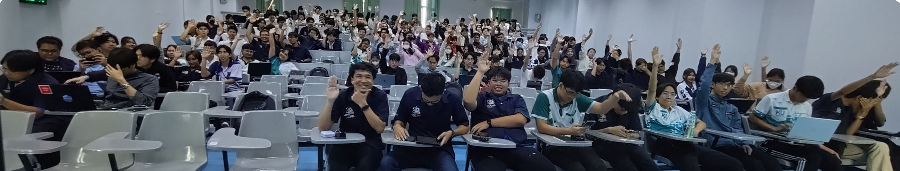

# 01418332 - Information System Security

### **Pre-Requisite**
- Operating System (01418236)

### **Hybrid Class**
- #17304, [Google Meet](https://meet.google.com/) & [Google Classroom](https://classroom.google.com/u/4/c/NzM1MjA0NDk2NjMy)

	

### **Time**
- 09:00 - 12:00 & 13:00 - 16:00

### **Classes**
- (Sat) **Nov 30**, 2024 (AM, PM) - **Session 1** & **2**

	

- (Sat) **Dec 7**, 2024 - **Session 3** (AM: [**1st half**](https://youtu.be/OwMqDKqsQ1Q) & [**2nd half**](https://youtu.be/qUCJg7BNLzw)) via Google Meet
- (Sat) **Dec 14**, 2024 - **Linux Skill** ([**link**](https://youtu.be/-iJUbxfYSeo)) via Google Meet
- (Mon) **Dec 16**, 2024 (Evening) - **ISC2 Badge** ([**link**](https://youtu.be/3DhcvUfnTvI)) via Google Meet
- (Sat) **Dec 21**, 2024 (AM, PM) - **Session 4** & **5**
- (Sat) **Dec 28**, 2024 - **Session 6**

### **Lecturer**
- [Maykin Warasart](https://www.google.com/search?q="Maykin+Warasart") ([เมฆินทร์ วรศาสตร์](https://www.google.com/search?q="เมฆินทร์ วรศาสตร์")), [[FB](https://www.facebook.com/maeklong)] [[X](https://x.com/maeklong)]
	- Microsoft MVP (Most Valuable Professional) – Security
	- Approved Volunteer – Center for Cyber Safe and Education
	- Microsoft Certified Trainer (MCT)
	- Microsoft Certified Educator (MCE)
	- Google Certified Educator (GCE) Level 1 & 2
	- CompTIA Certified Technical Trainer (CTT+) – Classroom Trainer
	- Modern Certified Classroom Trainer (MCCT) – Logical Operations
	- CIW – Certified Instructor (CI)
	- CAI – CertNexus Authorized Instructor
	- ETDA Digital Citizen (EDC) Trainer
	- Media Literacy Expert – Thai Media Fund
	- Security Awareness Specialist – Proofpoint
	- Cybersecurity Awareness Professional – CertiProf
- **Guest[s]**
	- TBA

### **Students**

---

[Addeen S.](https://itzdeenzxx.github.io/),
[Amarin Y.](https://6530200908.github.io/),
[Auksara S.](https://auksaraaa.github.io/),
[Boonphithak P.](https://mrzcrocodile.github.io/),
[Chaiwat S.](https://6530200606.github.io/),
[Chaiyaporn P.](https://lnwnott.github.io/),
[Chayanon P.](https://plantzaza.github.io/),
[Chayapol J.](https://copyyu.github.io/),
[Chitlada  P.](https://dreamchitlada.github.io/),
[Chonlasit K.](https://6530200088.github.io/),
[Chonnikarn S.](https://nixe97.github.io/),
Ekkapong W.,
[Guyyasit L.](https://guyyasit336.github.io/),
[Habibah M.](https://chocokorn.github.io/),
[Hannarong S.](https://deldel-p.github.io/),
[Jakapob S.](https://ioosck4.github.io/),
[Jatnipit K.](https://jatnipit.github.io/),
Jetnipat D.,
Kamolphop P.,
[Kanokwan R.](https://aomknw.github.io/),
[Kasidid Y.](https://kasidid-y.github.io/),
Kasidit P.,
[Kemikha C.](https://kemikha01.github.io/),
Kiadtiyod H.,
[Kitchakan S.](https://t2lxddd.github.io/),
Kittamaet R.,
[Kittithorn T.](https://kitty340822.github.io/),
Klittima C.,
Kongsiri P.,
[Krit C.](https://6530250000.github.io/),
Krittiphon Y.,
[Manatsawee P.](https://manatsawee-pi.github.io/),
Manitchaya B.,
[Nakorn T.](https://taedate.github.io/),
[Naphop K.](https://nutnaphop.github.io/),
Natchanan L.,
Natnicha N.,
[Nattanun K.](https://tnattanun.github.io/),
Nattapat K.,
[Nattawut S.](https://mizeto.github.io/),
[Nisita P.](https://nisita0309.github.io/),
Nonpawit S.,
[Nontawat P.](https://nontawatjgm.github.io/),
Nutparit S.,
[Onnicha S.](https://momojoj.github.io/),
[Panisara W.](https://6530200274.github.io/),
[Panissara B.](https://panissaraaa.github.io/),
Panissara P.,
[Panita Y.](https://panita18.github.io/),
Panumas C.,
[Panupong T.](https://6530200339.github.io/),
Panyawat L.,
[Pariyakorn K.](https://tintin1906.github.io/),
[Pasin H.](https://mater3214.github.io/),
Patitta K.,
[Pattarapa T.](https://6530250140.github.io/),
Pattaravut S.,
[Pattralada P.](https://skyandz.github.io/),
Peeramate J.,
[Penpicha P.](https://penpicha31.github.io/),
Phakkawat J.,
Phantharat T.,
[Phatsagon T.](https://phatsagon.github.io/),
Phetcharat T.,
[Phrommin K.](https://phrommin.github.io/),
Phurin P.,
[Phuriphat K.](https://prxsss.github.io/),
Pichanat P.,
Pichaya S.,
[Pisitchai W.](https://pisitchaiwongsopon.github.io/),
Piyaphum M.,
Pongpipat K.,
[Ponyakorn S.](https://ponyakorn.github.io/),
Poothripatn S.,
Poramet O.,
[Porawapat M.](https://porawapat-github.github.io/),
Preeyada K.,
Pruksakorn S.,
[Punnakan P.](https://qlerdev.github.io/),
Punyavee S.,
Purin Y.,
[Purinut E.](https://6530200762.github.io/),
Ratchaneekorn S.,
Ratiphong W.,
[Rattanapong M.](https://rattanapong7.github.io/),
Ratthakit K.,
Saharat O.,
[Sathana M.](https://sathanam10.github.io/),
Sathaporn S.,
Satintree P.,
[Sila K.](https://sila801.github.io/),
Sintana S.,
Siraphop C.,
[Siravet N.](https://9siravet.github.io/),
Sitthidech L.,
Sitthipong K.,
[Sittikorn P.](https://6530200525.github.io/),
Songwut S.,
[Sorasit P.](https://bossmahob.github.io/),
Sorravit M.,
Supakrit S.,
[Supawadee M.](https://donyweasley.github.io/),
[Suphattra P.](https://suphat00.github.io/),
Supphanimit N.,
Suprachai K.,
[Surachat K.](https://srchx.github.io/),
Suraphak A.,
[Tanapon Y.](https://jabjibi.github.io/),
Tanate W.,
Tanatorn J.,
[Teerakorn T.](https://teerakorn47.github.io/),
[Tep-amorn S.](https://tepamorn.github.io/,
[Thanabordee B.](https://realalunda.github.io/),
Thanapat U.,
[Thatthep S.](https://bastackle.github.io/),
Thawanrat P.,
[Thirawat S.](https://captainnn3.github.io/),
Thossaphol M.,
[Tinnapop R.](https://tinnapop-1728.github.io/),
Tippawan N.,
Ukrit J.,
[Valid N.](https://9jell.github.io/),
Veeraya L.,
[Vorapol B.](https://vorxp.github.io/),
Warakorn C.,
Warisara Y.,
[Wasawat B.](https://isnname.github.io/),
Watcharakorn R.,
Watcharaphon N.,
[Wichitchai S.](https://6530200452.github.io/),
[Wilaiphan K.](https://wilaiphan.github.io/),
Wilit K.,
[Witphon I](https://witchapolinaksorn.github.io/).

---

### **Tool[s]**
- [Dropbox](https://www.dropbox.com/referrals/AAC27q3e2sUydWpK3ig_PwLaCr8LjjVCZzI?src=global9)
- [Apache NetBeans](https://netbeans.apache.org/front/main/index.html)
	- [JDK](https://www.oracle.com/java/technologies/downloads/)
- [Oracle Virtual Box](https://www.virtualbox.org/wiki/Downloads)
	- [PuTTY](https://www.chiark.greenend.org.uk/~sgtatham/putty/latest.html)
	- [WinSCP](https://winscp.net/eng/download.php)
- [Visual Studio Code](https://code.visualstudio.com/download)
	- [Python](https://www.python.org/downloads/)
- [Gpg4win](https://www.gpg4win.org/)
- [Git](https://git-scm.com/downloads)
	- [GitHub](https://github.com/signup)
	- [Github Desktop](https://desktop.github.com/download/)
- [Microsoft Threat Modeling Tool](https://learn.microsoft.com/en-us/azure/security/develop/threat-modeling-tool)

### **Self Study**
- [Software Engineering Body of Knowledge (SWEBOK)](https://www.computer.org/education/bodies-of-knowledge/software-engineering)
- [Certified in Cybersecurity (CC) from ISC2](https://www.isc2.org/certifications/cc)
	- [NCSA x ISC2](https://ncsa.or.th/ncsaandisc.html) - [1MCC](https://www.isc2.org/landing/1mcc) Partner Program
- [Cybersecurity Fundamentals by APNIC](https://academy.apnic.net/en/course/cybersecurity-fundamentals)
	- [PGP Lab (File and Email Security)](https://academy.apnic.net/en/virtual-labs?labId=96763)
- [CyBOK v1.1](https://www.cybok.org/knowledgebase1_1/)
- NIST - [SP 800-57 Part 1 Rev. 5 - Recommendation for Key Management: Part 1 – General](https://csrc.nist.rip/publications/detail/sp/800-57-part-1/rev-5/final)
- [Security Engineering — 3rd Edition](https://www.cl.cam.ac.uk/archive/rja14/book.html)
- [The Intelligence Handbook](https://go.recordedfuture.com/the-intelligence-handbook-fourth-edition)
- [Security Essentials](https://learning.lpi.org/en/learning-materials/020-100/) - LPI
- [Developing Secure Software (LFD121)](https://training.linuxfoundation.org/training/developing-secure-software-lfd121/)
- [CNAPP For Dummies](https://ftnt.net/6014SaqQM)
- [Privileged Access Management for Dummies](https://delinea.com/resources/privileged-access-management-for-dummies-pdf)
- [Proposed Guide on Synthetic Data Generation](https://www.pdpc.gov.sg/help-and-resources/2024/07/proposed-guide-on-synthetic-data-generation)
- [แนวทางการกำหนดคุณลักษณะความมั่นคงปลอดภัยไซเบอร์ให้แก่ข้อมูลหรือระบบสารสนเทศ พ.ศ. 2567](https://ratchakitcha.soc.go.th/documents/49824.pdf)
- [7 Day Free Trial: Secure the Code with SANS Security Awareness Developer Training](https://www.sans.org/mlp/ssa-trial-request-developer/)
- [SonarSource static code analysis](https://rules.sonarsource.com/)
- [Browser automation challenges](https://youtube.com/watch?v=iZMvB3WNMPw)
- [Free Linux Foundation Courses for Cybersecurity Beginners](https://www.isc2.org/Insights/2024/07/Free-Linux-Foundation-Courses-for-Cybersecurity-Beginners)
- [Windows 11 Security Book](https://learn.microsoft.com/en-gb/windows/security/book/)
- [Guide to the Systems Engineering Body of Knowledge (SEBoK)](https://sebokwiki.org/wiki/Guide_to_the_Systems_Engineering_Body_of_Knowledge_(SEBoK))

### **Assignments**
- Merry Christmas & Happy New Year (**Steganography**)
	- [Nakorn Thungprapaporn](https://taedate.github.io/Marry-Christmas),
	[Kanokwan Riamsri](https://aomknw.github.io/e-card),
	[Sathana MONGKHON-IN](https://sathanam10.github.io/e-card_hny),
	[Punnakan Punsiri](https://qlerdev.github.io/xmas_hny_card),
	[Thatthep Sataranaporn](https://bastackle.github.io/ecard),
	[Siravet Nijnirundkul](https://9siravet.github.io/e-card_christmas),
	[Wichitchai Sapsanoi](https://6530200452.github.io/christmas),
	[Purinut EKPONGPRADIT](https://6530200762.github.io/e-card),
	[Manatsawee Piyasopasakul](https://manatsawee-pi.github.io/e-card),
	[Chonlasit Kijkulpichet](https://6530200088.github.io/ecardChristmas),
	[Sorasit PANYANG](https://bossmahob.github.io/christmas_card),
	[Tinnapop Ratchada](https://tinnapop-1728.github.io/e-card),
	[Penpicha Priwan](https://penpicha31.github.io/e-card),
	[Naphop Khumchawna](https://nutnaphop.github.io/e-card-hny),
	[Sittikorn Pratomwan](https://6530200525.github.io/happyny),
	[Kemikha Chan-Ngam](https://kemikha01.github.io/e-card-Christmas),
	[Pattralada POBTEEPHUENG](https://skyandz.github.io/e-card),
	[Onnicha Srisaman](https://momojoj.github.io/e-card),
	[Panissara Boonprakorb](https://panissaraaa.github.io/E-Card),
	[Pariyakorn Kullama](https://tintin1906.github.io/Christmas&NewYear_card),
	[Supawadee MUANGPRASERT](https://donyweasley.github.io/newyear-ecard2025),
	[Chitlada Prasroetsang](https://dreamchitlada.github.io/e-card),
	[Habibah Masae](https://chocokorn.github.io/ecardchristmas),
	[Kitchakan Sripaeng](https://t2lxddd.github.io/ecard),
	[Panisara Wijarn](https://6530200274.github.io/e-card),
	[Witphon Inaksorn](https://witchapolinaksorn.github.io/eCardChristmas),
	[Wilaiphan Kunlachet](https://wilaiphan.github.io/e-card),
	[Panita Yapolha](https://panita18.github.io/e-card),
	[Suphattra Prasomsap](https://suphat00.github.io/e-card),
	[Chayanon Pansaguan](https://plantzaza.github.io/e-card),
	[Ponyakorn Srinuchart](https://ponyakorn.github.io/christmas),
	[Tep-amorn Singkornkiew](https://tepamorn.github.io/e-card),
	[Chonnikarn Sangwang](https://nixe97.github.io/HappyNewyear)

                          